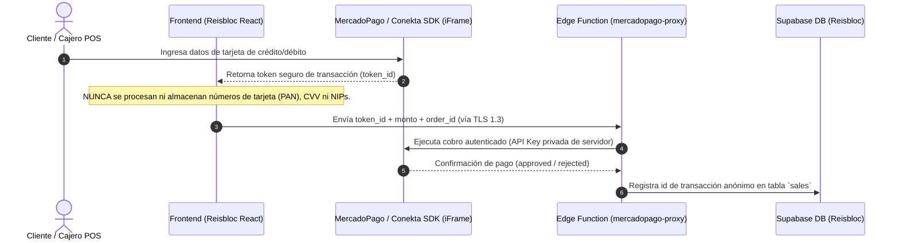

# 💳 Declaración de Cumplimiento PCI-DSS v4.0 (SAQ A / SAQ A-EP) — Reisbloc Retail

**Payment Card Industry Data Security Standard (PCI-DSS v4.0)**  
**Fecha de Evaluación:** Julio 2026  
**Perfil de Comercio:** SaaS Retail POS & E-Commerce (Elegible para Self-Assessment Questionnaire A / SAQ A-EP)

---

## 🏗️ 1. Arquitectura del Flujo de Pagos y Tokenización

Reisbloc Retail aplica una política estricta de **Tokenización y Reducción de Alcance (Out-of-Scope Architecture)**:

---

## 📋 2. Matriz de Cumplimiento de Requisitos PCI-DSS v4.0

### Requisito 2: Aplicar configuraciones seguras a todos los componentes
- [x] **2.2.1:** Se prohíbe el uso de contraseñas por defecto. El registro fuerza hashing Bcrypt en PINs de cajero.
- [x] **2.2.7:** Encabezados de seguridad HTTP forzados (`Strict-Transport-Security`, `X-Frame-Options: DENY`, `X-Content-Type-Options: nosniff`).

### Requisito 3: Proteger los datos de cuentas almacenados
- [x] **3.1.1:** Reisbloc **NO almacena, procesa ni transmite datos primarios de cuenta (PAN), datos de banda magnética ni códigos de validación (CVV/CVC)** en sus bases de datos o servidores.

### Requisito 6: Desarrollar y mantener sistemas y software seguros
- [x] **6.2.4:** Prevención de vulnerabilidades de software (Inyección SQL por ORM/Supabase, XSS evitado con `DOMPurify`, CSRF prevenido con cookies SameSite/JWT).
- [x] **6.3.1:** Auditoría continua de vulnerabilidades automatizada en CI/CD con GitHub Actions (`.github/workflows/security-audit.yml`).

### Requisito 8: Identificar usuarios y autenticar el acceso
- [x] **8.2.1:** Identificadores únicos requeridos para cada usuario (`auth.uid()`).
- [x] **8.3.6:** Autenticación de múltiples factores (MFA) disponible para administradores primarios.

### Requisito 11: Probar la seguridad de los sistemas de forma regular
- [x] **11.3.1:** Análisis continuo de código estático (SAST) y escaneo de secretos (TruffleHog) en cada commit a la rama principal.

### Requisito 12: Apoyar la seguridad de la información con políticas corporativas
- [x] **12.1.1:** Política oficial de seguridad de la información publicada y revisada anualmente ([docs/INFORMATION_SECURITY_POLICY.md](file:///Users/Daniel/reisbloc-retail/docs/INFORMATION_SECURITY_POLICY.md)).
- [x] **12.8.2:** Mantener listado actualizado de proveedores de servicio de pago (MercadoPago S.A. de C.V. y Conekta S.A.P.I. de C.V.) con atestaciones PCI-DSS Nivel 1 vigentes.
